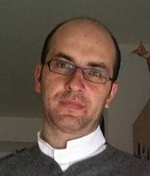
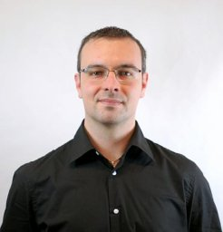
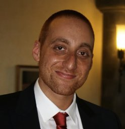

# HyperSCI
## 1st International Workshop on Theory and Applications of Hypernetwork Science
[International Conference on Advances in Social Networks Analysis and Mining (ASONAM)](https://asonam.cpsc.ucalgary.ca/2024/) 
September 4, 2024 
Rende (CS), Italy

Traditionally, complex systems have been successfully studied through graphs abstracting the underlying relations with vertices and edges connecting pairs of interacting components. Yet, many real-world systems are **characterized by group interactions** that cannot be described simply in terms of dyads. Studying such systems requires new mathematical frameworks and scientific methodologies for its investigation. **Hypergraphs** are the perfect candidates to tackle this task, as these structures are a generalization of graphs where a (hyper)edge allows the connection of an arbitrary number of vertices. However, the powerful expressiveness of hypergraphs has a few drawbacks: dealing with the complexity of such data structures and the need for appropriate tools and algorithms for their study.

Given the considerable potential and the growing interest of the research community in overcoming the challenges of exploiting hypergraphs and, more generally, high-order networks to unravel real-world group dynamics, we propose a workshop on **Theory and Applications of Hypernetwork Science** (HyperSCI) at the ASONAM Conference 2024. The goal of this workshop is to focus the attention of the ASONAM research community on addressing the open questions and challenges in this thriving research area. Given the broad range of competencies in the ASONAM community, the workshop will welcome methodological contributions as well as applications to real-world problems, tool implementations, and the development of reference hypergraphs that can serve as test beds.  We believe that instantiating one of the first workshops on hypernetwork science will inspire the community to share new ideas and development, addressing well-known challenges and identifying new ones.

## Topics 
Relevant papers cover one or more of the following topics:
- Theoretical Aspects of Hypernetwork Science
- Hypergraph Algorithms and Measures 
- Multidimensional and Temporal Hypernetworks
- Dynamics on and of Hypernetworks
- Static and dynamic Hypernetwork clustering/community discovery
- Hypergraph representation learning
- Mining and learning in hypergraphs with missing information and noise
- (Large-scale) Hypergraph visualization
- Computational Tools and Libraries for Hypernetwork Science
- Deep learning for Web hypergraphs
- Online Social Hypernetwork Mining and Analysis
- Applied Hypernetwork Science (cognition, economics, biology and medicine, engineering, etc.)

## Important Dates





" align="left" color="info" %}

 

 
<b>Workshop Program Chairs</b>

  

  <a href="https://alessant.github.io/"><b>Alessia Antelmi</b></a>
  
Università degli Studi di Torino

  <a href="https://linktr.ee/andreafailla"><b>Andrea Failla</b></a>
  
Università di Pisa

 
<b>General chairs</b>

 

  <a href="https://www.francescocauteruccio.info/"><b>Francesco Cauteruccio</b></a>
  
Università degli Studi di Salerno

  <a href="https://sites.google.com/site/cordasco/"><b>Gennaro Cordasco</b></a>
  
Università della Campania

 

  <a href="https://makgyver.github.io/"><b>Mirko Polato</b></a>
  
Università degli Studi di Torino

  <a href="https://giuliorossetti.github.io/"><b>Giulio Rossetti</b></a>
  
ISTI-CNR

  <a href="https://spagnuolocarmine.github.io/"><b>Carmine Spagnuolo</b></a>
  
Università degli Studi di Salerno

 

